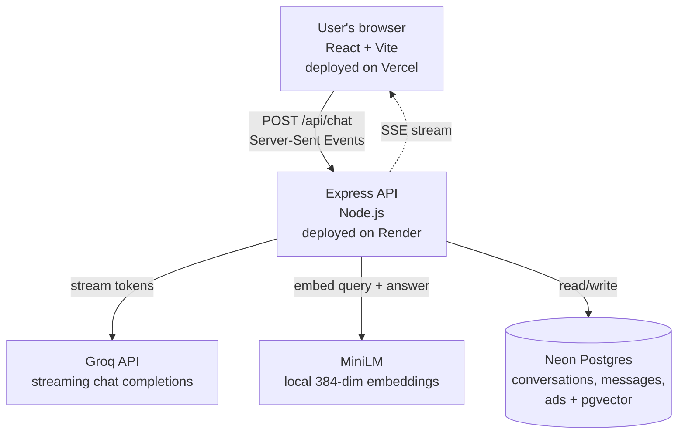

# Contextual Ads AI Chatbot

An AI chatbot that generates answers and matches semantically relevant sponsored content against both the user's query and the AI's response.

**🔗 Live demo:** https://contextual-ads-chatbot-nine.vercel.app/ 
**📦 Source:** https://github.com/Vidhwan101/contextual-ads-chatbot

---

## What this actually is

Most ad systems match sponsored content to keywords. That fails for AI chat, because what matters is whether the ad is relevant to *the answer*, not just the question.

This project uses a two-stage matching pipeline:

1. **Candidate retrieval** — when the user sends a message, we embed it locally with a MiniLM model (384-dim) and fetch the top 30 ad candidates by cosine similarity from pgvector. This runs in parallel with the LLM stream, so it adds no latency.
2. **Answer-aware re-ranking** — after the LLM finishes generating, we embed the full answer and re-score every candidate against both the query and the answer. Ads must clear a relevance gate to be shown at all — high bidders can't pay their way past irrelevance.

The top 2 matching ads stream to the client as a final SSE event and are displayed as sponsored cards below the response. Every placement is logged with its query similarity, answer similarity, and score for CTR analysis.

---

## Sample behavior

| Query | Matched ad(s) | Query sim | Answer sim |
|---|---|---|---|
| "How do I protect my computer from ransomware?" | Backblaze, NordVPN | 0.34 / 0.28 | 0.48 / 0.39 |
| "I want to book flight tickets, what documents do I need?" | Booking.com | 0.51 | 0.43 |
| "What is 2+2?" | *(none — gate correctly filtered)* | < 0.22 | < 0.28 |
| "What documents do I need for a student visa?" | *(none — correctly filtered)* | 0.098 | 0.134 |

The last two rows are the important ones. The relevance gate is doing its job — no ads on unrelated queries, no ads on government-paperwork questions that only *look* travel-related.

---

## Architecture



---

## Tech stack

- **Frontend:** React 18, Vite, Tailwind CSS
- **Backend:** Node.js, Express 5, Server-Sent Events
- **Database:** Neon Postgres with `pgvector` extension
- **ORM:** Prisma 6
- **AI:** Groq (streaming chat completions), Hugging Face Transformers.js (local MiniLM embeddings)
- **Deployment:** Vercel (frontend), Render (backend), Neon (database)

---

## Features

- Streaming AI responses via Server-Sent Events
- Persistent conversation history (per-browser session)
- Auto-titled conversations from first message
- Two-stage semantic ad matching with relevance gating
- Click tracking and impression logging per placement
- Scroll-lock protection: read history while streaming without being yanked to the bottom

---

## Running locally

```bash
# 1. Clone
git clone https://github.com/Vidhwan101/contextual-ads-chatbot.git
cd contextual-ads-chatbot

# 2. Backend
cd server
npm install
# create .env with GROQ_API_KEY, DATABASE_URL, PORT, STREAM_DELAY_MS
npx prisma migrate dev
npm run seed          # seeds ads with embeddings
npm run dev           # http://localhost:4000

# 3. Frontend (new terminal)
cd client
npm install
# create .env with VITE_API_URL=http://localhost:4000
npm run dev           # http://localhost:5173
```

You'll need:

- A Groq API key (free tier: https://console.groq.com)
- A Postgres database with `pgvector` — Neon (https://neon.tech) is free and has it built-in

---

## Environment variables

### `server/.env`

```
GROQ_API_KEY=gsk_...              # from console.groq.com
DATABASE_URL=postgresql://...     # from neon.tech (must have pgvector)
PORT=4000
STREAM_DELAY_MS=15                # cosmetic pacing for token streaming
CLIENT_URL=http://localhost:5173  # comma-separated list in production
NODE_ENV=development
```

### `client/.env`

```
VITE_API_URL=http://localhost:4000
```

---

## Design decisions

**Why local embeddings instead of OpenAI?**
MiniLM runs on CPU, needs no API key, no credit card, and no rate limits. For a portfolio project it's the correct tradeoff — 384-dim embeddings are good enough for ad matching, and the model caches in memory after first load.

**Why is relevance a gate, not a weight?**
If bid were mixed into the score linearly, high bidders would push irrelevant ads into the results. Users notice irrelevant ads instantly, trust collapses, and CTR dies. The gate enforces a floor — an ad that doesn't clear both similarity thresholds never shows, no matter what it bids.

**Why weight answer similarity higher than query similarity?**
"Aligned to the answer" means that if a user asks *"best laptop for video editing"* and the answer discusses Apple Silicon vs Intel for Premiere, the ad should be about *that specific point*, not just "laptops." The answer similarity captures this.

**Why was `max_tokens` capped at 800?**
Groq's free tier caps `qwen/qwen3.8-27b` at 1000 output tokens per minute. We set `max_tokens: 800` to stay safely under the limit while allowing full-length answers.

---

## License

MIT
