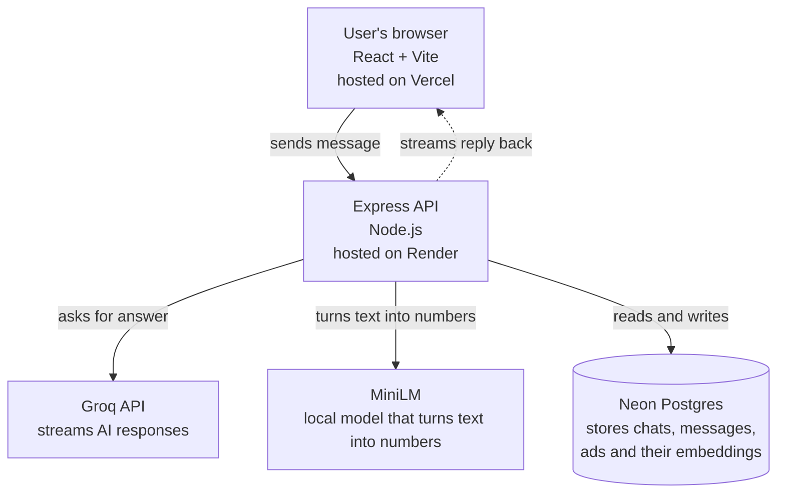

# Contextual Ads AI Chatbot

An AI chatbot that answers your questions and then shows sponsored content that actually matches what the answer is talking about.

**Live demo:** https://contextual-ads-chatbot.vercel.app
**Source code:** https://github.com/Vidhwan101/contextual-ads-chatbot

---

## What this project does

Most ad systems match ads to keywords. If you search "flights", they show you flight ads. Simple.

But that does not work well for AI chat. Because the AI's answer might be about something specific. If you ask "what documents do I need for a flight", the answer is about passports and visas, not about booking flights. So a flight booking ad would feel out of place.

This project solves that. It looks at both your question AND the AI's answer, then picks ads that fit both.

Here is how it works, in two steps:

**Step 1. Find candidates.**
When you send a message, we convert it into numbers (called an embedding) using a local AI model. Then we ask the database: "give me the 30 ads whose numbers are closest to this." This runs while the AI is thinking, so it does not slow anything down.

**Step 2. Pick the best ones.**
After the AI finishes answering, we convert the answer into numbers too. Now we score every candidate ad against both your question and the AI's answer. Ads have to pass a minimum score, or they get thrown out completely. A high bidder cannot buy their way in if the ad is not relevant.

The top 2 ads get sent to the browser and shown as sponsored cards below the answer. Every ad we show gets logged with its score, so we can see later which ones perform well.

---

## What actually happens for different questions

| You ask | Ad shown | Why |
|---|---|---|
| "How do I protect my computer from ransomware?" | Backblaze, NordVPN | Backup and security services fit perfectly |
| "I want to book flight tickets, what documents do I need?" | Booking.com | Travel intent is clear |
| "What is 2+2?" | Nothing | No ad is relevant, so none show |
| "What documents do I need for a student visa?" | Nothing | Looks travel related but is actually a paperwork question |

The last two rows are the important ones. They show the system is smart enough to say "no" when nothing fits. Showing an irrelevant ad is worse than showing no ad.

---

## Architecture



---

## Built with

- **Frontend:** React 18, Vite, Tailwind CSS
- **Backend:** Node.js, Express 5, Server-Sent Events
- **Database:** Neon Postgres with the pgvector extension
- **ORM:** Prisma 6
- **AI:** Groq (for chat), Hugging Face Transformers.js (for embeddings)
- **Hosting:** Vercel (frontend), Render (backend), Neon (database)

---

## Features

- AI replies stream in word by word, like ChatGPT
- Chat history is saved and comes back after you refresh
- Conversations get titled automatically from your first message
- Ads are matched using real semantic similarity, not keywords
- Irrelevant ads get filtered out, so you never see spam
- You can scroll up and read older messages while a new answer is streaming

---

## Running it on your own machine

```bash
# 1. Get the code
git clone https://github.com/Vidhwan101/contextual-ads-chatbot.git
cd contextual-ads-chatbot

# 2. Set up the backend
cd server
npm install
# create a .env file with GROQ_API_KEY and DATABASE_URL
npx prisma migrate dev
npm run seed          # adds the sample ads with their embeddings
npm run dev           # backend runs at http://localhost:4000

# 3. Set up the frontend (open a new terminal)
cd client
npm install
# create a .env file with VITE_API_URL=http://localhost:4000
npm run dev           # frontend runs at http://localhost:5173
```

You will need two things:

- A Groq API key (free at https://console.groq.com)
- A Postgres database that supports pgvector (Neon gives you one free at https://neon.tech)

---

## Settings you need to provide

### Backend (server/.env)

```
GROQ_API_KEY=gsk_...              # get this from console.groq.com
DATABASE_URL=postgresql://...     # get this from neon.tech
PORT=4000
STREAM_DELAY_MS=15                # makes the streaming feel natural to read
CLIENT_URL=http://localhost:5173  # your frontend URL
NODE_ENV=development
```

### Frontend (client/.env)

```
VITE_API_URL=http://localhost:4000
```

---

## Why I made certain choices

**Why use a local model for embeddings instead of OpenAI?**
The local model (MiniLM) runs on your computer. It needs no API key, no credit card, and has no rate limits. For a project like this, that is the right call. The quality is good enough, and after the first download it loads instantly.

**Why do ads have to pass a minimum score instead of just ranking by best score?**
If we just ranked by score, a high paying advertiser could always show up even if their ad has nothing to do with the answer. Users hate that. So we set a minimum bar. If an ad does not clear it, it does not show at all. No exceptions, no matter what it pays.

**Why do we care more about matching the answer than the question?**
Because the question alone can be misleading. Someone asks "best laptop for video editing" and the AI answer goes deep into Apple Silicon vs Intel. An ad about "laptops" in general is too vague. An ad about "M-series MacBook for video work" is much better. Matching against the answer catches this.

**Why cap the AI response at 800 tokens?**
Groq's free plan limits the AI to 1000 output tokens per minute. Setting the cap at 800 keeps us safely under that limit while still allowing full length answers.

---

## License

MIT